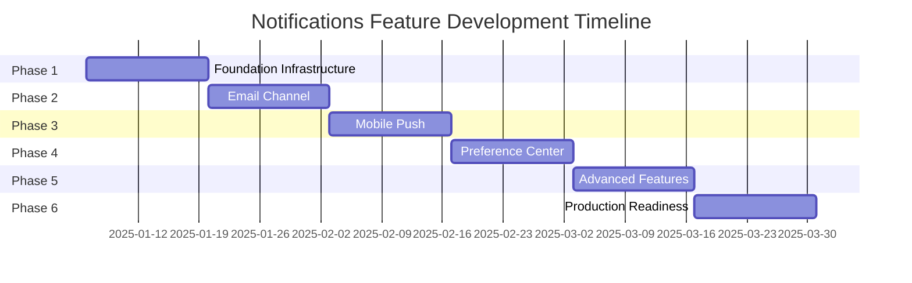

# Notifications Feature - Technical Implementation Plan

**Feature Name**: Multi-Channel Notifications System  
**Version**: 1.0.0  
**Date**: 2025-07-22  
**Author**: Development Team  
**Status**: Planning  
**Dependencies**: core-todo, due-dates features

## 1. Executive Summary

The Notifications feature will provide a comprehensive multi-channel notification system for the Simple Todo application, enabling users to receive timely reminders through browser notifications, email, mobile push notifications, and in-app alerts. Building upon the basic browser notifications from the due-dates feature, this implementation will create a scalable, user-centric notification infrastructure that improves task completion rates while maintaining user control and preventing notification fatigue.

### Key Deliverables
- Multi-channel notification delivery (browser, email, mobile push, in-app)
- User preference management with granular controls
- Smart notification bundling and quiet hours
- Real-time notification center with history
- Webhook support for third-party integrations
- Analytics and monitoring capabilities

### Success Criteria
- 80% notification opt-in rate
- <5% unsubscribe rate
- 99.9% delivery success rate
- <2s average delivery time
- 30% improvement in task completion rates

## 2. Current State Analysis

### Existing Infrastructure
The due-dates feature has established basic browser notifications with:
- Simple browser permission request
- Basic notification display for due tasks
- Limited user controls
- No persistence or history
- Single-channel delivery only

### Limitations to Address
1. **Single Channel**: Only browser notifications supported
2. **No User Control**: Minimal preference management
3. **No Persistence**: Notifications lost if missed
4. **No Intelligence**: No bundling or timing optimization
5. **Limited Actions**: Cannot interact with notifications
6. **No Analytics**: No tracking of effectiveness

### Technical Debt
- Browser notification implementation tightly coupled to due-dates
- No abstraction layer for multi-channel support
- Missing notification queue infrastructure
- No standardized notification data model

## 3. Proposed Solution

### 3.1 Architecture Overview

```
┌─────────────────────────────────────────────────────────────────────┐
│                          Frontend (Next.js)                         │
├─────────────────────┬───────────────────┬─────────────────────────┤
│  Notification UI    │   Preference UI   │   Notification Center   │
│  Components         │   Components      │   Components            │
└─────────────────────┴───────────────────┴─────────────────────────┘
                                |
                    ┌──────────────────────────┐
                    │   Zustand Stores        │
                    │  - notificationStore    │
                    │  - preferenceStore      │
                    │  - channelStore         │
                    └──────────────────────────┘
                                |
                    ┌──────────────────────────┐
                    │   Effects Layer         │
                    │  - notificationEffect   │
                    │  - schedulerEffect      │
                    │  - bundlingEffect       │
                    └──────────────────────────┘
                                |
┌─────────────────────────────────────────────────────────────────────┐
│                      Notification Service Layer                      │
├─────────────────┬────────────────┬────────────────┬────────────────┤
│  Scheduler      │  Queue Manager │  Bundling      │  Delivery      │
│  Service        │  (BullMQ)      │  Engine        │  Manager       │
└─────────────────┴────────────────┴────────────────┴────────────────┘
                                |
┌─────────────────────────────────────────────────────────────────────┐
│                         Channel Adapters                             │
├─────────────────┬────────────────┬────────────────┬────────────────┤
│  Browser Push   │  Email Service │  Mobile Push   │  In-App        │
│  (Service Worker)│  (SendGrid)    │  (FCM/APNs)    │  (WebSocket)   │
└─────────────────┴────────────────┴────────────────┴────────────────┘
```

### 3.2 Core Components

#### Notification Service
```typescript
// Central notification orchestrator
class NotificationService {
  private scheduler: NotificationScheduler;
  private queueManager: QueueManager;
  private bundlingEngine: BundlingEngine;
  private channels: Map<string, NotificationChannel>;
  
  async send(notification: NotificationContent): Promise<void> {
    // Apply user preferences
    // Check quiet hours
    // Route to appropriate channels
    // Track delivery
  }
}
```

#### Channel Abstraction
```typescript
interface NotificationChannel {
  name: string;
  isAvailable(): Promise<boolean>;
  send(notification: NotificationContent): Promise<DeliveryResult>;
  requestPermission?(): Promise<PermissionState>;
  updateToken?(token: string): Promise<void>;
}
```

#### Preference Management
```typescript
interface NotificationPreferences {
  global: GlobalPreferences;
  channels: ChannelPreferences;
  categories: CategoryPreferences;
  quietHours: QuietHoursConfig;
  bundling: BundlingRules;
}
```

### 3.3 Data Model

#### Notification Entity
```typescript
interface Notification {
  id: string;
  userId: string;
  category: NotificationCategory;
  priority: Priority;
  title: string;
  body: string;
  data: Record<string, any>;
  scheduledFor: Date;
  channels: Channel[];
  status: NotificationStatus;
  metadata: NotificationMetadata;
}
```

#### Database Schema
```sql
-- Core notification tables
CREATE TABLE notifications (
  id UUID PRIMARY KEY,
  user_id UUID NOT NULL,
  category VARCHAR(50) NOT NULL,
  priority VARCHAR(20) NOT NULL,
  title VARCHAR(255) NOT NULL,
  body TEXT NOT NULL,
  data JSONB,
  scheduled_for TIMESTAMP NOT NULL,
  status VARCHAR(20) NOT NULL,
  created_at TIMESTAMP DEFAULT NOW()
);

CREATE TABLE notification_deliveries (
  id UUID PRIMARY KEY,
  notification_id UUID REFERENCES notifications(id),
  channel VARCHAR(50) NOT NULL,
  status VARCHAR(20) NOT NULL,
  sent_at TIMESTAMP,
  delivered_at TIMESTAMP,
  error_message TEXT,
  metadata JSONB
);

CREATE TABLE user_preferences (
  user_id UUID PRIMARY KEY,
  preferences JSONB NOT NULL,
  updated_at TIMESTAMP DEFAULT NOW()
);

CREATE TABLE push_tokens (
  id UUID PRIMARY KEY,
  user_id UUID NOT NULL,
  platform VARCHAR(20) NOT NULL,
  token TEXT NOT NULL,
  active BOOLEAN DEFAULT true,
  created_at TIMESTAMP DEFAULT NOW()
);
```

## 4. Implementation Steps

### Phase 1: Foundation Infrastructure (Weeks 1-2)

#### Week 1: Core Architecture
1. **Day 1-2: Service Architecture**
   - Set up notification service structure
   - Implement channel abstraction interface
   - Create base notification types and interfaces
   - Set up error handling and logging

2. **Day 3-4: Queue Infrastructure**
   - Install and configure BullMQ with Redis
   - Create queue definitions for each priority level
   - Implement basic job processing
   - Set up retry logic and dead letter queues

3. **Day 5: Scheduler Service**
   - Implement notification scheduling logic
   - Create cron job for recurring notifications
   - Handle timezone conversions
   - Build schedule management APIs

#### Week 2: State Management & Browser Notifications
1. **Day 1-2: Zustand Stores**
   - Create notificationStore for notification state
   - Create preferenceStore for user preferences
   - Implement persistence middleware
   - Add store subscriptions for effects

2. **Day 3-4: Browser Channel Enhancement**
   - Refactor existing browser notifications
   - Implement service worker for background notifications
   - Add rich notification support
   - Create permission management flow

3. **Day 5: Testing & Documentation**
   - Unit tests for core services
   - Integration tests for queue processing
   - API documentation
   - Architecture decision records

### Phase 2: Email Channel (Weeks 3-4)

#### Week 3: Email Service Integration
1. **Day 1-2: SendGrid Setup**
   - Configure SendGrid account and API keys
   - Set up domain authentication (SPF/DKIM)
   - Create email service adapter
   - Implement basic email sending

2. **Day 3-4: Template System**
   - Set up Handlebars for email templates
   - Create base email template with responsive design
   - Implement template variables and partials
   - Build template preview system

3. **Day 5: Email Preferences**
   - Add email channel to preference UI
   - Implement unsubscribe handling
   - Create preference center links
   - Build email verification flow

#### Week 4: Email Features & Testing
1. **Day 1-2: Advanced Email Features**
   - Implement bounce and complaint handling
   - Add email analytics tracking
   - Create digest email functionality
   - Build A/B testing framework

2. **Day 3-4: Email Testing**
   - Unit tests for email service
   - Template rendering tests
   - Email preview testing
   - Load testing for bulk sends

3. **Day 5: Production Readiness**
   - Monitor email deliverability
   - Set up email analytics dashboard
   - Configure rate limiting
   - Document email best practices

### Phase 3: Mobile Push Notifications (Weeks 5-6)

#### Week 5: Push Infrastructure
1. **Day 1-2: Firebase Setup**
   - Configure Firebase Cloud Messaging
   - Set up Apple Push Notification service
   - Create push notification service
   - Implement token management

2. **Day 3-4: Mobile Integration**
   - Build token registration endpoints
   - Implement platform-specific payload formatting
   - Create deep linking support
   - Handle token refresh logic

3. **Day 5: Rich Notifications**
   - Implement notification actions
   - Add image support
   - Create notification categories
   - Build sound and badge management

#### Week 6: Push Features & Testing
1. **Day 1-2: Advanced Push Features**
   - Implement silent notifications
   - Create notification grouping
   - Add localization support
   - Build fallback mechanisms

2. **Day 3-4: Push Testing**
   - End-to-end push testing
   - Token management testing
   - Platform compatibility testing
   - Performance testing

3. **Day 5: Mobile Polish**
   - Optimize battery usage
   - Implement delivery confirmation
   - Add push analytics
   - Create troubleshooting guide

### Phase 4: Preference Center (Weeks 7-8)

#### Week 7: Preference UI
1. **Day 1-2: Core Preference Components**
   ```typescript
   // Main preference center
   components/
   ├── PreferenceCenter.tsx
   ├── ChannelSettings.tsx
   ├── CategorySettings.tsx
   ├── QuietHoursConfig.tsx
   └── BundlingSettings.tsx
   ```

2. **Day 3-4: Preference Management**
   - Build preference API endpoints
   - Implement real-time preference updates
   - Create preference templates
   - Add import/export functionality

3. **Day 5: Quiet Hours**
   - Implement quiet hours logic
   - Build timezone-aware scheduling
   - Create override mechanisms
   - Add visual indicators

#### Week 8: Advanced Preferences
1. **Day 1-2: Notification Center**
   - Build notification feed component
   - Implement real-time updates
   - Add filtering and search
   - Create batch operations

2. **Day 3-4: User Experience**
   - Add preference wizards
   - Create smart defaults
   - Build A/B testing for preferences
   - Implement preference analytics

3. **Day 5: Testing & Polish**
   - Comprehensive preference testing
   - Accessibility testing
   - Performance optimization
   - User documentation

### Phase 5: Advanced Features (Weeks 9-10)

#### Week 9: Intelligence & Automation
1. **Day 1-2: Smart Bundling**
   - Implement bundling algorithm
   - Create category-based grouping
   - Build time-window logic
   - Add bundle templates

2. **Day 3-4: Delivery Optimization**
   - Implement priority queues
   - Create channel fallback logic
   - Build delivery confirmation
   - Add retry strategies

3. **Day 5: Webhook Support**
   - Create webhook management API
   - Implement webhook security
   - Build delivery queue
   - Add webhook testing tools

#### Week 10: Analytics & Monitoring
1. **Day 1-2: Analytics Implementation**
   - Set up event tracking
   - Create analytics dashboard
   - Build metric aggregation
   - Implement data retention

2. **Day 3-4: Monitoring & Alerts**
   - Configure system monitoring
   - Set up alerting rules
   - Create health checks
   - Build status page

3. **Day 5: Documentation**
   - Complete API documentation
   - Create integration guides
   - Build troubleshooting docs
   - Prepare training materials

### Phase 6: Production Readiness (Weeks 11-12)

#### Week 11: Performance & Scale
1. **Day 1-2: Performance Optimization**
   - Optimize database queries
   - Implement caching strategies
   - Reduce payload sizes
   - Improve queue processing

2. **Day 3-4: Load Testing**
   - Conduct load testing
   - Test with 100K+ notifications
   - Optimize bottlenecks
   - Validate scalability

3. **Day 5: Security Audit**
   - Security review
   - Penetration testing
   - Privacy compliance check
   - Vulnerability scanning

#### Week 12: Launch Preparation
1. **Day 1-2: Migration & Rollout**
   - Prepare migration scripts
   - Create feature flags
   - Plan phased rollout
   - Set up monitoring

2. **Day 3-4: Final Testing**
   - End-to-end testing
   - User acceptance testing
   - Performance validation
   - Rollback procedures

3. **Day 5: Launch**
   - Deploy to production
   - Monitor initial usage
   - Gather feedback
   - Address issues

## 5. Technical Requirements

### 5.1 Infrastructure

#### Backend Services
- **Node.js**: v18+ with TypeScript
- **Redis**: v7+ for queue management
- **PostgreSQL**: v14+ for data persistence
- **Docker**: For containerization
- **Kubernetes**: For orchestration (future)

#### Third-Party Services
- **SendGrid**: Email delivery
- **Firebase Cloud Messaging**: Android push
- **Apple Push Notification Service**: iOS push
- **Sentry**: Error tracking
- **DataDog**: Monitoring (optional)

### 5.2 Development Tools

#### Required Packages
```json
{
  "dependencies": {
    // Queue Management
    "bullmq": "^4.0.0",
    "ioredis": "^5.0.0",
    
    // Scheduling
    "node-cron": "^3.0.0",
    "date-fns": "^3.0.0",
    "date-fns-tz": "^2.0.0",
    
    // Email
    "@sendgrid/mail": "^7.7.0",
    "handlebars": "^4.7.0",
    "mjml": "^4.14.0",
    
    // Push Notifications
    "firebase-admin": "^11.0.0",
    "node-pushnotifications": "^2.0.0",
    "@parse/node-apn": "^5.1.0",
    
    // Browser Notifications
    "web-push": "^3.6.0",
    "workbox-window": "^7.0.0",
    
    // Real-time
    "socket.io": "^4.6.0",
    "socket.io-client": "^4.6.0",
    
    // Utilities
    "joi": "^17.9.0",
    "uuid": "^9.0.0",
    "lodash": "^4.17.21",
    "p-queue": "^7.3.0"
  },
  "devDependencies": {
    "@types/node-cron": "^3.0.0",
    "@types/lodash": "^4.14.0",
    "jest": "^29.5.0",
    "@testing-library/react": "^14.0.0"
  }
}
```

### 5.3 Component Structure

```
src/features/notifications/
├── components/
│   ├── channels/
│   │   ├── BrowserNotificationSetup.tsx
│   │   ├── EmailNotificationSetup.tsx
│   │   ├── PushNotificationSetup.tsx
│   │   └── ChannelStatus.tsx
│   ├── preferences/
│   │   ├── PreferenceCenter.tsx
│   │   ├── QuietHoursSettings.tsx
│   │   ├── CategoryPreferences.tsx
│   │   └── NotificationTiming.tsx
│   ├── center/
│   │   ├── NotificationCenter.tsx
│   │   ├── NotificationItem.tsx
│   │   ├── NotificationFilters.tsx
│   │   └── NotificationActions.tsx
│   └── common/
│       ├── NotificationBadge.tsx
│       ├── NotificationToast.tsx
│       └── PermissionPrompt.tsx
├── stores/
│   ├── notificationStore.ts
│   ├── preferenceStore.ts
│   ├── channelStore.ts
│   └── historyStore.ts
├── hooks/
│   ├── useNotifications.ts
│   ├── useNotificationPermission.ts
│   ├── useNotificationPreferences.ts
│   ├── useChannels.ts
│   └── useNotificationHistory.ts
├── effects/
│   ├── notificationEffect.ts
│   ├── channelEffect.ts
│   ├── schedulerEffect.ts
│   └── syncEffect.ts
├── services/
│   ├── NotificationService.ts
│   ├── channels/
│   │   ├── BrowserChannel.ts
│   │   ├── EmailChannel.ts
│   │   ├── PushChannel.ts
│   │   └── InAppChannel.ts
│   ├── QueueManager.ts
│   ├── Scheduler.ts
│   └── BundlingEngine.ts
├── types/
│   ├── notification.types.ts
│   ├── channel.types.ts
│   ├── preference.types.ts
│   └── delivery.types.ts
├── utils/
│   ├── permissions.ts
│   ├── formatting.ts
│   ├── validation.ts
│   └── timezone.ts
├── workers/
│   ├── notification.worker.ts
│   └── service-worker.ts
└── templates/
    ├── email/
    │   ├── base.hbs
    │   ├── due-reminder.hbs
    │   ├── overdue-alert.hbs
    │   └── digest.hbs
    └── push/
        ├── due-reminder.json
        └── overdue-alert.json
```

## 6. Data & API Considerations

### 6.1 API Design

#### RESTful Endpoints
```typescript
// Notification APIs
POST   /api/notifications/send
GET    /api/notifications/history
PATCH  /api/notifications/:id/read
DELETE /api/notifications/:id

// Preference APIs
GET    /api/notifications/preferences
PUT    /api/notifications/preferences
POST   /api/notifications/preferences/reset

// Channel APIs
GET    /api/notifications/channels
POST   /api/notifications/channels/:channel/enable
DELETE /api/notifications/channels/:channel/disable
POST   /api/notifications/channels/:channel/test

// Webhook APIs
GET    /api/notifications/webhooks
POST   /api/notifications/webhooks
PUT    /api/notifications/webhooks/:id
DELETE /api/notifications/webhooks/:id
```

#### GraphQL Schema (Future)
```graphql
type Notification {
  id: ID!
  category: NotificationCategory!
  priority: Priority!
  title: String!
  body: String!
  scheduledFor: DateTime!
  status: NotificationStatus!
  deliveries: [Delivery!]!
  actions: [NotificationAction!]
}

type Query {
  notifications(filter: NotificationFilter): [Notification!]!
  notificationPreferences: NotificationPreferences!
  notificationChannels: [Channel!]!
}

type Mutation {
  sendNotification(input: SendNotificationInput!): Notification!
  updatePreferences(input: UpdatePreferencesInput!): NotificationPreferences!
  markNotificationRead(id: ID!): Notification!
  snoozeNotification(id: ID!, until: DateTime!): Notification!
}

type Subscription {
  notificationReceived(userId: ID!): Notification!
}
```

### 6.2 Data Migration

#### Migration Strategy
1. **Phase 1**: Migrate existing browser notification settings
2. **Phase 2**: Create default preferences for all users
3. **Phase 3**: Import notification history from logs
4. **Phase 4**: Set up channel configurations

#### Migration Scripts
```sql
-- Migrate existing due-date notifications
INSERT INTO notification_preferences (user_id, preferences)
SELECT 
  user_id,
  jsonb_build_object(
    'channels', jsonb_build_object(
      'browser', jsonb_build_object('enabled', true)
    ),
    'categories', jsonb_build_object(
      'due_date', jsonb_build_object('enabled', true)
    )
  )
FROM users
WHERE notification_enabled = true;
```

### 6.3 Performance Considerations

#### Caching Strategy
- **Redis Cache**: User preferences, channel status
- **In-Memory Cache**: Template compilation, timezone data
- **CDN Cache**: Static notification assets
- **Browser Cache**: Service worker assets

#### Database Optimization
- **Indexes**: scheduled_for, user_id, status
- **Partitioning**: Monthly partitions for notification_log
- **Archival**: Move old notifications to cold storage
- **Connection Pooling**: Optimize connection limits

## 7. Testing Plan

### 7.1 Unit Testing

#### Service Tests
```typescript
describe('NotificationService', () => {
  describe('send', () => {
    it('should route to enabled channels');
    it('should respect user preferences');
    it('should handle channel failures gracefully');
    it('should enforce rate limits');
    it('should check quiet hours');
  });
  
  describe('schedule', () => {
    it('should schedule future notifications');
    it('should handle timezone conversions');
    it('should cancel scheduled notifications');
    it('should handle recurring patterns');
  });
});

describe('BundlingEngine', () => {
  it('should bundle similar notifications');
  it('should respect time windows');
  it('should exclude urgent notifications');
  it('should create meaningful summaries');
  it('should handle category-specific rules');
});
```

#### Channel Tests
```typescript
describe('EmailChannel', () => {
  it('should send HTML and plain text versions');
  it('should include unsubscribe links');
  it('should handle template variables');
  it('should validate email addresses');
  it('should track delivery status');
});

describe('PushChannel', () => {
  it('should format platform-specific payloads');
  it('should handle token expiration');
  it('should support rich notifications');
  it('should implement retry logic');
});
```

### 7.2 Integration Testing

#### Multi-Channel Scenarios
```typescript
describe('Multi-channel delivery', () => {
  it('should deliver to all configured channels');
  it('should fall back when primary channel fails');
  it('should track delivery status per channel');
  it('should handle partial failures');
  it('should respect channel preferences');
});

describe('Preference synchronization', () => {
  it('should update preferences in real-time');
  it('should sync across devices');
  it('should handle concurrent updates');
  it('should validate preference changes');
});
```

### 7.3 End-to-End Testing

#### Critical User Flows
1. **Notification Setup Flow**
   - Enable browser notifications
   - Configure email preferences
   - Set quiet hours
   - Receive test notification

2. **Daily Usage Flow**
   - Receive morning digest
   - Get due date reminder
   - Snooze notification
   - Mark task complete from notification

3. **Preference Management Flow**
   - Access preference center
   - Update channel settings
   - Configure categories
   - Save and verify changes

### 7.4 Performance Testing

#### Load Test Scenarios
```yaml
scenarios:
  - name: "Peak Morning Load"
    users: 10000
    rampUp: 5m
    duration: 30m
    actions:
      - sendDigestEmails
      - scheduleDueReminders
      - processNotificationQueue
    
  - name: "Bulk Notification Send"
    notifications: 100000
    channels: ["browser", "email", "push"]
    expectedThroughput: 1000/s
    maxLatency: 2s
```

#### Stress Test Targets
- 100K concurrent users
- 1M notifications/hour
- 10M queued notifications
- 99.9% delivery success rate

### 7.5 Accessibility Testing

#### WCAG 2.1 Compliance
- **Notification Center**: Full keyboard navigation
- **Preference UI**: Screen reader compatibility
- **Email Templates**: High contrast mode
- **Toast Notifications**: Sufficient display time
- **Action Buttons**: Clear focus indicators

### 7.6 Security Testing

#### Security Test Cases
1. **Input Validation**: XSS prevention in notification content
2. **Authentication**: Webhook signature verification
3. **Authorization**: User can only access own notifications
4. **Rate Limiting**: Prevent notification spam
5. **Data Privacy**: PII handling in notifications

## 8. Timeline Estimates

### Development Timeline (12 Weeks)



### Resource Allocation

| Role | Allocation | Duration | Key Responsibilities |
|------|------------|----------|---------------------|
| Backend Developer (2) | 100% | 12 weeks | Service implementation, API development |
| Frontend Developer (2) | 80% | 10 weeks | UI components, state management |
| Mobile Developer (1) | 50% | 4 weeks | Push notification integration |
| DevOps Engineer (1) | 50% | 6 weeks | Infrastructure, deployment |
| QA Engineer (1) | 60% | 8 weeks | Testing, automation |
| UX Designer (1) | 25% | 4 weeks | UI/UX design, user flows |

### Key Milestones

1. **Week 2**: Basic notification service operational
2. **Week 4**: Email notifications fully functional
3. **Week 6**: Mobile push notifications ready
4. **Week 8**: Complete preference center deployed
5. **Week 10**: All advanced features integrated
6. **Week 12**: Production-ready with full testing

## 9. Risk Assessment & Mitigation

### Technical Risks

| Risk | Impact | Probability | Mitigation Strategy |
|------|--------|-------------|-------------------|
| **Notification Spam** | High | High | Smart bundling, frequency limits, easy opt-out, user education |
| **Permission Denial** | High | High | Progressive permission request, value proposition, fallback channels |
| **Delivery Failures** | Medium | Medium | Multi-channel redundancy, retry logic, monitoring, fallback mechanisms |
| **Queue Overflow** | Medium | Low | Auto-scaling, priority queues, TTL for notifications, archival |
| **Performance Degradation** | High | Medium | Caching, database optimization, horizontal scaling, load balancing |
| **Third-party Service Outage** | Medium | Medium | Multiple providers, circuit breakers, graceful degradation |
| **Token Management Complexity** | Low | High | Automatic refresh, re-registration flows, token validation |
| **Cross-platform Inconsistency** | Medium | High | Abstraction layer, extensive testing, platform-specific handling |

### Business Risks

| Risk | Impact | Probability | Mitigation Strategy |
|------|--------|-------------|-------------------|
| **User Adoption** | High | Medium | Onboarding flow, clear benefits, gradual rollout, A/B testing |
| **Infrastructure Costs** | Medium | Medium | Efficient batching, caching, usage limits, cost monitoring |
| **Regulatory Compliance** | High | Low | GDPR tools, consent tracking, privacy by design, legal review |
| **Feature Complexity** | Medium | High | Phased release, simple defaults, user education, feedback loops |

### Mitigation Strategies

1. **Phased Rollout**
   - Start with 10% of users
   - Monitor metrics closely
   - Gradually increase coverage
   - Feature flags for quick rollback

2. **User Education**
   - In-app tutorials
   - Email guides
   - Help documentation
   - Video walkthroughs

3. **Monitoring & Alerts**
   - Real-time delivery metrics
   - Error rate monitoring
   - User feedback tracking
   - Performance dashboards

## 10. Dependencies

### 10.1 Feature Dependencies

#### Required Features (Must be complete)
- **core-todo**: Basic todo functionality
- **due-dates**: Task scheduling and due date management
- **user-authentication**: User accounts and sessions
- **data-persistence**: Database storage

#### Enhanced Features (Nice to have)
- **categories**: For category-based notifications
- **recurring-tasks**: For recurring reminders
- **collaboration**: For shared task notifications
- **analytics**: For notification effectiveness tracking

### 10.2 Technical Dependencies

#### Infrastructure
- **Redis**: Queue and cache management
- **PostgreSQL**: Data persistence
- **SendGrid Account**: Email delivery
- **Firebase Project**: Push notifications
- **SSL Certificates**: Secure communications

#### External Services
- **Email Service**: SendGrid or AWS SES
- **Push Services**: FCM and APNs
- **Monitoring**: Sentry for error tracking
- **Analytics**: Mixpanel or similar (optional)

### 10.3 Team Dependencies

#### Cross-team Coordination
- **Mobile Team**: Push notification SDK integration
- **DevOps Team**: Infrastructure provisioning
- **Security Team**: Security review and compliance
- **Product Team**: Feature prioritization and UX
- **Legal Team**: Privacy policy updates

## 11. Success Metrics & KPIs

### 11.1 Adoption Metrics

| Metric | Target | Measurement |
|--------|--------|-------------|
| Opt-in Rate | 80% | Users enabling notifications / Total users |
| Channel Adoption | Browser: 60%, Email: 70%, Push: 40% | Channel enabled / Total opted-in users |
| Preference Customization | 50% | Users modifying defaults / Total users |
| Retention Rate | 90% after 30 days | Users keeping notifications enabled |

### 11.2 Engagement Metrics

| Metric | Target | Measurement |
|--------|--------|-------------|
| Open Rate | Email: 35%, Push: 25% | Opened / Delivered |
| Click Rate | Browser: 30%, Email: 15% | Clicked / Delivered |
| Action Rate | 20% | Actions taken / Notifications with actions |
| Snooze Rate | <20% | Snoozed / Total notifications |

### 11.3 Technical Metrics

| Metric | Target | Measurement |
|--------|--------|-------------|
| Delivery Success | 99.9% | Delivered / Attempted |
| Delivery Latency | <2s average | Time from trigger to delivery |
| Queue Processing | <5s p99 | Time in queue before processing |
| System Uptime | 99.95% | Uptime / Total time |

### 11.4 Business Impact

| Metric | Target | Measurement |
|--------|--------|-------------|
| Task Completion Rate | +30% | Tasks completed on time |
| User Engagement | +25% DAU | Daily active users |
| Overdue Reduction | -20% | Overdue tasks per user |
| Feature NPS | >50 | Net Promoter Score |

## 12. Appendices

### A. Technical Specifications

#### Notification Payload Examples

**Browser Notification**
```javascript
{
  title: "Task Due in 1 Hour",
  body: "Complete project report",
  icon: "/icon-192.png",
  badge: "/badge-72.png",
  tag: "due-reminder",
  renotify: true,
  requireInteraction: true,
  actions: [
    { action: "complete", title: "✓ Complete" },
    { action: "snooze", title: "⏰ Snooze" }
  ],
  data: {
    todoId: "uuid",
    dueDate: "2025-01-15T10:00:00Z",
    category: "due_date"
  }
}
```

**Email Notification**
```json
{
  "to": "user@example.com",
  "subject": "Reminder: Complete project report",
  "templateId": "due-reminder",
  "dynamicTemplateData": {
    "userName": "John",
    "taskTitle": "Complete project report",
    "dueTime": "10:00 AM",
    "taskUrl": "https://app.example.com/todos/uuid",
    "unsubscribeUrl": "https://app.example.com/unsubscribe?token=xxx"
  }
}
```

### B. API Documentation

#### Send Notification
```http
POST /api/notifications/send
Content-Type: application/json
Authorization: Bearer <token>

{
  "userId": "user-uuid",
  "category": "due_date",
  "priority": "normal",
  "title": "Task Due Soon",
  "body": "Complete project report - Due in 1 hour",
  "data": {
    "todoId": "todo-uuid"
  },
  "scheduledFor": "2025-01-15T09:00:00Z",
  "channels": ["browser", "email"]
}

Response:
{
  "id": "notification-uuid",
  "status": "scheduled",
  "scheduledFor": "2025-01-15T09:00:00Z"
}
```

### C. Configuration Examples

#### Environment Variables
```env
# Notification Service
NOTIFICATION_QUEUE_REDIS_URL=redis://localhost:6379
NOTIFICATION_WORKER_CONCURRENCY=10
NOTIFICATION_MAX_RETRIES=3

# Email Configuration
SENDGRID_API_KEY=SG.xxx
SENDGRID_FROM_EMAIL=notifications@example.com
SENDGRID_FROM_NAME=Simple Todo

# Push Configuration
FCM_SERVER_KEY=xxx
APNS_KEY_ID=xxx
APNS_TEAM_ID=xxx
APNS_BUNDLE_ID=com.example.simpletodo

# Feature Flags
FEATURE_EMAIL_NOTIFICATIONS=true
FEATURE_PUSH_NOTIFICATIONS=true
FEATURE_NOTIFICATION_ANALYTICS=true
```

### D. Troubleshooting Guide

#### Common Issues

1. **Browser Notifications Not Showing**
   - Check browser permissions
   - Verify service worker registration
   - Check notification API support
   - Review console errors

2. **Email Delivery Issues**
   - Verify domain authentication
   - Check spam folder
   - Review bounce logs
   - Validate email templates

3. **Push Notification Failures**
   - Verify token validity
   - Check platform credentials
   - Review payload format
   - Monitor delivery logs

### E. Migration Checklist

- [ ] Backup existing notification data
- [ ] Run migration scripts in staging
- [ ] Verify data integrity
- [ ] Update environment variables
- [ ] Deploy service worker
- [ ] Configure email domain
- [ ] Set up push certificates
- [ ] Enable feature flags
- [ ] Monitor initial traffic
- [ ] Gather user feedback

---

**Document Status**: Complete  
**Version**: 1.0.0  
**Last Updated**: 2025-07-22  
**Next Review**: Post-Phase 1 Implementation