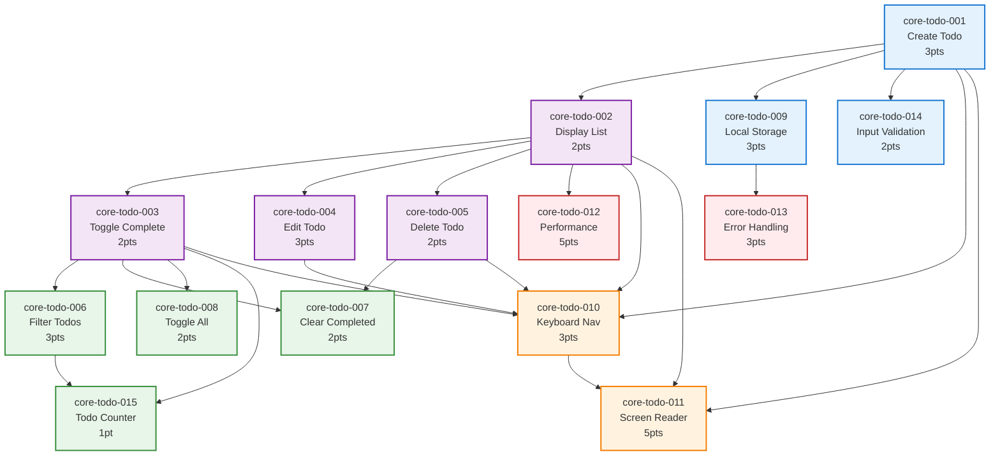

# Core Todo Feature - Story Dependencies

**Feature**: core-todo  
**Total Stories**: 15  
**Critical Path Length**: 4 levels  

## Visual Dependency Graph

## Dependency Analysis

### Critical Path
The longest dependency chain that must be completed sequentially:

1. **core-todo-001** (Create Todo) - 3 points
2. **core-todo-002** (Display List) - 2 points
3. **core-todo-003** (Toggle Complete) - 2 points
4. **core-todo-006** (Filter Todos) - 3 points
5. **core-todo-015** (Todo Counter) - 1 point

**Total Critical Path**: 11 story points (minimum)

### Dependency Layers

#### Layer 1: Foundation (No Dependencies)
- **core-todo-001**: Create Todo (3 pts)

#### Layer 2: Basic Infrastructure
- **core-todo-002**: Display List (depends on 001)
- **core-todo-009**: Local Storage (depends on 001)
- **core-todo-014**: Input Validation (depends on 001)

#### Layer 3: Core Features
- **core-todo-003**: Toggle Complete (depends on 001, 002)
- **core-todo-004**: Edit Todo (depends on 001, 002)
- **core-todo-005**: Delete Todo (depends on 001, 002)
- **core-todo-010**: Keyboard Nav (depends on 001-005)
- **core-todo-012**: Performance (depends on 002)
- **core-todo-013**: Error Handling (depends on 009)

#### Layer 4: Enhanced Features
- **core-todo-006**: Filter Todos (depends on 002, 003)
- **core-todo-007**: Clear Completed (depends on 003, 005)
- **core-todo-008**: Toggle All (depends on 003)
- **core-todo-011**: Screen Reader (depends on 001, 002, 010)

#### Layer 5: Final Features
- **core-todo-015**: Todo Counter (depends on 003, 006)

### Parallel Development Opportunities

#### Sprint 1 Parallel Work
- Developer A: core-todo-001, core-todo-002
- Developer B: core-todo-009, core-todo-014

#### Sprint 2 Parallel Work
- Developer A: core-todo-003, core-todo-004
- Developer B: core-todo-005, core-todo-013

#### Sprint 3 Parallel Work
- Developer A: core-todo-006, core-todo-007
- Developer B: core-todo-008, core-todo-010

### Blocking Dependencies

| Story | Blocks | Blocked By | Risk Level |
|-------|--------|------------|------------|
| core-todo-001 | 9 stories | None | Critical |
| core-todo-002 | 7 stories | 001 | High |
| core-todo-003 | 4 stories | 001, 002 | High |
| core-todo-010 | 1 story | 001-005 | Medium |
| core-todo-009 | 1 story | 001 | Medium |

### Development Strategy

#### Sequential Requirements
1. **Must complete first**: core-todo-001 (Create Todo)
2. **Must complete second**: core-todo-002 (Display List)
3. **Then parallelize**: Multiple tracks can proceed

#### Parallel Tracks After Layer 2

**Track A: Core CRUD**
- core-todo-003 → core-todo-006 → core-todo-015
- core-todo-004 (independent)
- core-todo-005 → core-todo-007

**Track B: Quality Features**
- core-todo-010 → core-todo-011
- core-todo-012 (performance)
- core-todo-013 (error handling)

**Track C: Bulk Operations**
- core-todo-008 (toggle all)

### Risk Mitigation

#### High-Risk Dependencies
1. **core-todo-001** failure blocks entire project
   - Mitigation: Prioritize and thoroughly test
   
2. **core-todo-010** depends on 5 stories
   - Mitigation: Start planning early, mock dependencies
   
3. **core-todo-011** has complex requirements
   - Mitigation: Involve accessibility expert early

#### Dependency Bottlenecks
- **Layer 2-3 Transition**: Many stories wait for 002
- **Accessibility Track**: Sequential 010 → 011
- **Filter Features**: Sequential 003 → 006 → 015

### Optimized Development Order

1. **Week 1**: 001 → 002 (parallel: 009, 014)
2. **Week 2**: 003, 004, 005 (parallel: 013)
3. **Week 3**: 006, 007, 008 (parallel: 010)
4. **Week 4**: 011, 015
5. **Week 5**: 012 + testing

---

**Last Updated**: 2025-07-22  
**Tool**: Mermaid diagram (render in any Markdown viewer)