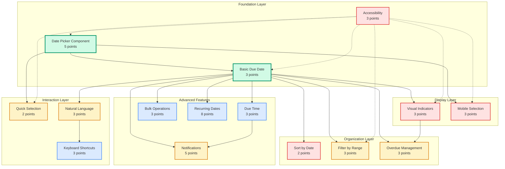

# Due Dates Feature - Dependency Graph

## Visual Dependency Map



## Dependency Analysis

### Critical Path
The critical path for the Due Dates feature follows this sequence:
1. **DD-002** → **DD-001** → **DD-004** → Core feature complete
2. Additional features can be developed in parallel after DD-001

### Foundation Dependencies

#### DD-002: Date Picker Component (No dependencies)
- Must be completed first
- Blocks 4 other stories
- Critical for entire feature

#### DD-001: Basic Due Date (Depends on DD-002)
- Central story that blocks 10+ others
- Must be stable before proceeding
- Contains core data model changes

### Parallel Development Opportunities

After DD-001 is complete, these can be developed in parallel:
- **Team 1**: DD-005 (Sort) + DD-006 (Filter)
- **Team 2**: DD-003 (Quick Select) + DD-011 (Mobile)
- **Team 3**: DD-007 (Notifications)
- **Team 4**: DD-013 (Accessibility - ongoing)

### Story Groupings

#### Group 1: Core Infrastructure
- DD-002: Date Picker Component
- DD-001: Basic Due Date
- DD-013: Accessibility (cross-cutting)

#### Group 2: User Experience
- DD-004: Visual Indicators
- DD-011: Mobile Selection
- DD-003: Quick Selection
- DD-015: Natural Language Input

#### Group 3: Organization Tools
- DD-005: Sort by Date
- DD-006: Filter by Range
- DD-014: Overdue Management

#### Group 4: Advanced Features
- DD-007: Notifications
- DD-009: Due Time
- DD-010: Bulk Operations
- DD-012: Keyboard Shortcuts
- DD-008: Recurring Dates

## Risk Analysis

### High-Risk Dependencies

1. **DD-001 (Basic Due Date)**
   - Risk: Central blocker for 10+ stories
   - Mitigation: Prioritize in Sprint 1, thorough testing
   
2. **DD-002 (Date Picker)**
   - Risk: Complex component affecting UX
   - Mitigation: Use established library, extensive testing

3. **DD-007 (Notifications)**
   - Risk: Browser API limitations
   - Mitigation: Early prototype, fallback strategies

### Low-Risk Dependencies

1. **DD-012 (Keyboard Shortcuts)**
   - Only depends on DD-015
   - Can be deferred if needed

2. **DD-010 (Bulk Operations)**
   - Only depends on DD-001
   - Independent feature

## Implementation Strategy

### Phase 1: Foundation (Must Complete)
```
DD-002 → DD-001 → DD-004
         ↓
      DD-013 (ongoing)
```

### Phase 2: Core Features (Parallel)
```
DD-001 → DD-005 (Sort)
      → DD-006 (Filter)
      → DD-003 (Quick Select)
      → DD-011 (Mobile)
```

### Phase 3: Enhanced Features
```
DD-001 → DD-007 (Notifications)
      → DD-014 (Overdue)
      → DD-015 (Natural Language) → DD-012 (Shortcuts)
```

### Phase 4: Advanced Features
```
DD-001 → DD-009 (Time)
      → DD-010 (Bulk)
      → DD-008 (Recurring)
```

## Dependency Rules

### Must Complete Before Production
1. DD-002: Date Picker Component
2. DD-001: Basic Due Date
3. DD-004: Visual Indicators
4. DD-011: Mobile Selection
5. DD-013: Accessibility

### Can Be Released Incrementally
1. DD-003: Quick Selection
2. DD-005: Sort by Date
3. DD-006: Filter by Range
4. DD-015: Natural Language Input
5. DD-007: Notifications

### Future Enhancements
1. DD-008: Recurring Dates
2. DD-009: Due Time
3. DD-010: Bulk Operations
4. DD-012: Keyboard Shortcuts
5. DD-014: Overdue Management

## Testing Dependencies

### Integration Test Order
1. Date Picker + Basic Due Date
2. Visual Indicators + Sort/Filter
3. Mobile + Accessibility
4. Notifications + Overdue
5. Bulk Operations + Recurring

### E2E Test Scenarios
1. Create todo with due date (DD-001)
2. Change due date via picker (DD-002)
3. Quick select tomorrow (DD-003)
4. Sort by due date (DD-005)
5. Filter overdue tasks (DD-006)
6. Receive notification (DD-007)
7. Bulk reschedule (DD-010)

## Conclusion

The dependency graph shows a clear critical path through DD-002 → DD-001 → DD-004, with DD-013 (Accessibility) as a cross-cutting concern. After the foundation is established, multiple teams can work in parallel on different feature groups. The highest risk is in the foundation layer, so these stories should be prioritized and thoroughly tested before proceeding with dependent features.