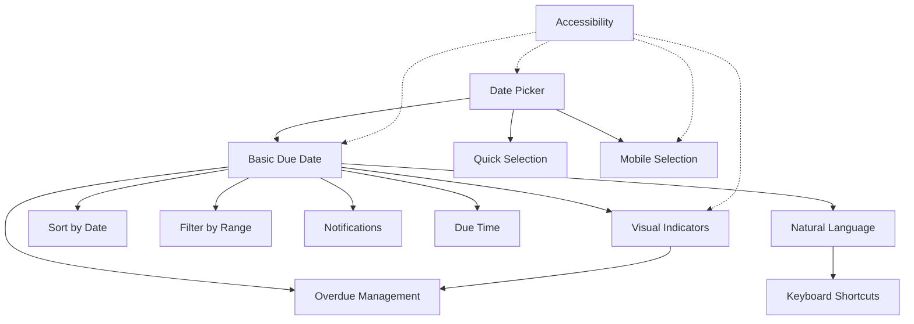

# Due Dates Feature - User Stories Index

**Feature**: Due Dates
**Total Story Points**: 63
**High Priority Stories**: 5
**Medium Priority Stories**: 5
**Low Priority Stories**: 5

## Story List

### High Priority (Sprint 1-2)
1. [DD-001: Basic Due Date Addition](./DD-001-basic-due-date-addition.md) - **3 points**
2. [DD-002: Date Picker UI Component](./DD-002-date-picker-component.md) - **5 points**
3. [DD-004: Visual Due Date Indicators](./DD-004-visual-due-date-indicators.md) - **3 points**
4. [DD-005: Sort by Due Date](./DD-005-sort-by-due-date.md) - **2 points**
5. [DD-011: Mobile Date Selection](./DD-011-mobile-date-selection.md) - **3 points**
6. [DD-013: Due Date Accessibility](./DD-013-due-date-accessibility.md) - **3 points**

**Sprint 1-2 Total**: 19 points

### Medium Priority (Sprint 3-4)
1. [DD-003: Quick Date Selection](./DD-003-quick-date-selection.md) - **2 points**
2. [DD-006: Filter by Date Range](./DD-006-filter-by-date-range.md) - **3 points**
3. [DD-007: Due Date Notifications](./DD-007-due-date-notifications.md) - **5 points**
4. [DD-014: Overdue Task Management](./DD-014-overdue-task-management.md) - **3 points**
5. [DD-015: Natural Language Date Input](./DD-015-natural-language-input.md) - **3 points**

**Sprint 3-4 Total**: 16 points

### Low Priority (Future Sprints)
1. [DD-008: Recurring Due Dates](./DD-008-recurring-due-dates.md) - **8 points**
2. [DD-009: Due Time Addition](./DD-009-due-time-addition.md) - **3 points**
3. [DD-010: Bulk Due Date Operations](./DD-010-bulk-due-date-operations.md) - **3 points**
4. [DD-012: Keyboard Shortcuts for Due Dates](./DD-012-keyboard-shortcuts.md) - **3 points**

**Future Sprints Total**: 17 points

## Dependencies Graph



## Implementation Roadmap

### Phase 1: Foundation (Week 1-2)
- Set up data models and storage
- Implement basic date picker component
- Add due dates to todo items
- Create visual indicators
- Ensure mobile compatibility
- Complete accessibility audit

### Phase 2: Core Features (Week 3-4)
- Add quick date selection
- Implement sorting and filtering
- Set up notification system
- Create overdue task handling
- Add natural language input

### Phase 3: Advanced Features (Week 5-6)
- Add time selection
- Implement bulk operations
- Create keyboard shortcuts
- Performance optimization

### Phase 4: Premium Features (Future)
- Recurring task system
- Calendar view integration
- Advanced analytics
- API integration

## Technical Considerations

### Required Libraries
- `date-fns` - Date manipulation and formatting
- `date-fns-tz` - Timezone support
- `chrono-node` - Natural language date parsing
- `@radix-ui/react-popover` - Accessible popover base
- `@radix-ui/react-select` - Accessible select components

### Key Technical Challenges
1. **Timezone Handling**: Store in UTC, display in local
2. **Performance**: Efficient sorting/filtering for large lists
3. **Accessibility**: Full keyboard and screen reader support
4. **Mobile UX**: Native-like experience on touch devices
5. **Notifications**: Cross-browser compatibility

### Data Model Extensions
```typescript
interface Todo {
  // Existing fields
  id: string;
  text: string;
  completed: boolean;
  createdAt: string;
  updatedAt: string;
  
  // New due date fields
  dueDate?: string;        // ISO date string
  dueTime?: string;        // HH:MM format
  timezone?: string;       // IANA timezone
  reminder?: {
    enabled: boolean;
    minutesBefore: number;
  };
  recurrence?: RecurrenceRule;
}
```

## Success Metrics
- 70% of users set at least one due date within 30 days
- 50% of todos have due dates within 90 days
- Less than 3% accessibility-related issues
- Page load time impact < 50ms
- 95% successful notification delivery rate

## Next Steps
1. Review and prioritize stories with stakeholders
2. Refine story points based on team velocity
3. Create technical design documents
4. Set up development environment
5. Begin Sprint 1 with high-priority stories