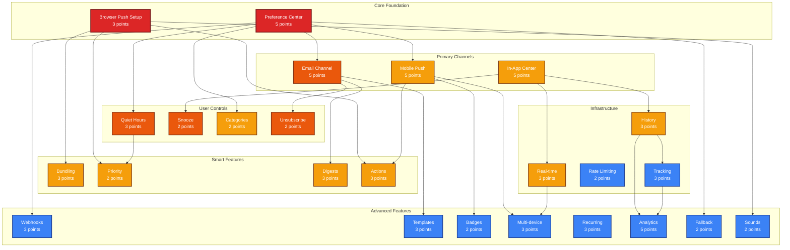

# Notifications Feature - Dependency Graph

## Visual Dependency Map



## Dependency Analysis

### Critical Path

The critical path for MVP notification functionality:

```
NOT-002 (Preference Center) 
    ↓
NOT-001 (Browser Push) + NOT-003 (Email)
    ↓
NOT-005 (Quiet Hours) + NOT-008 (Snooze)
    ↓
MVP Complete
```

### Dependency Layers

#### Layer 1: Foundation (Must Complete First)
- **NOT-002: Preference Center** - Central hub blocking 6 other stories
- **NOT-001: Browser Push Setup** - Core notification infrastructure

#### Layer 2: Primary Channels (Parallel Development)
- **NOT-003: Email Channel** - Can start after preferences
- **NOT-004: Mobile Push** - Can start after preferences
- **NOT-006: In-App Center** - Independent development

#### Layer 3: Core Features (After Channels)
- **NOT-005: Quiet Hours** - Depends on preferences
- **NOT-008: Snooze** - Depends on notification center
- **NOT-007: Smart Bundling** - Depends on browser push
- **NOT-017: Unsubscribe** - Depends on email channel

#### Layer 4: Enhanced Features
- **NOT-010: Priority** - Depends on browser push & quiet hours
- **NOT-011: Digests** - Depends on email channel
- **NOT-013: Actions** - Depends on browser & mobile push
- **NOT-019: Real-time** - Depends on notification center

#### Layer 5: Advanced Features
- All remaining stories with minimal blocking dependencies

## Implementation Strategy

### Phase 1: Foundation Sprint
```
Implement NOT-002 first (blocks most features)
    ↓
Start NOT-001 in parallel
    ↓
Complete foundation
```

### Phase 2: Multi-Channel Sprint
```
Three parallel tracks:
1. Email team: NOT-003 → NOT-017
2. Mobile team: NOT-004 → NOT-020  
3. Web team: NOT-006 → NOT-008
```

### Phase 3: Smart Features Sprint
```
Parallel implementation:
- NOT-007 (Bundling)
- NOT-010 (Priority)
- NOT-011 (Digests)
- NOT-013 (Actions)
```

### Phase 4: Infrastructure Sprint
```
Build monitoring and analytics:
- NOT-009 → NOT-016 → NOT-023
- NOT-019 (Real-time)
- NOT-018 (Rate limiting)
```

## Risk Analysis

### High-Risk Dependencies

1. **NOT-002 (Preference Center)**
   - **Risk**: Blocks 6+ stories
   - **Impact**: Delays entire feature
   - **Mitigation**: Prioritize in Sprint 1, allocate best resources

2. **NOT-001 (Browser Push)**
   - **Risk**: Complex browser compatibility
   - **Impact**: Blocks actions and smart features
   - **Mitigation**: Early prototyping, fallback strategies

3. **NOT-019 (Real-time)**
   - **Risk**: Complex infrastructure
   - **Impact**: Poor user experience
   - **Mitigation**: Start WebSocket setup early

### Low-Risk Dependencies

1. **NOT-025 (Sounds)** - Only depends on browser setup
2. **NOT-018 (Rate Limiting)** - Can be added anytime
3. **NOT-024 (Fallback)** - Enhancement to existing channels

## Parallel Development Opportunities

### Sprint 2-3 Parallel Tracks

**Track A: Email Team**
- NOT-003: Email Channel
- NOT-015: Templates
- NOT-017: Unsubscribe

**Track B: Mobile Team**
- NOT-004: Mobile Push
- NOT-020: Badges
- Platform testing

**Track C: Web Team**
- NOT-006: Notification Center
- NOT-008: Snooze
- NOT-019: Real-time

**Track D: Backend Team**
- NOT-007: Bundling
- NOT-009: History
- NOT-018: Rate Limiting

## Dependency Rules

### Must Have for MVP
1. NOT-002: Preference Center
2. NOT-001: Browser Push
3. NOT-003: Email Channel
4. NOT-005: Quiet Hours
5. NOT-008: Snooze
6. NOT-017: Unsubscribe

### Can Be Released Incrementally
1. NOT-004: Mobile Push
2. NOT-006: In-App Center
3. NOT-011: Digests
4. NOT-013: Actions
5. NOT-019: Real-time

### Future Enhancements
- All analytics features
- Webhook integration
- Multi-device sync
- Custom sounds
- Recurring patterns

## Testing Dependencies

### Integration Test Order
1. Preferences + Browser Push
2. Email + Unsubscribe
3. Quiet Hours + Priority
4. Mobile + Actions
5. Real-time + Multi-device

### E2E Test Scenarios
1. Enable notifications → Receive first notification
2. Set preferences → Verify channel routing
3. Configure quiet hours → Test override
4. Snooze notification → Verify re-delivery
5. Multi-channel delivery → Track all channels

## Technical Dependencies

### Infrastructure Requirements
- **Redis**: Required for NOT-007, NOT-018, NOT-019
- **PostgreSQL**: Required for NOT-009, NOT-016, NOT-023
- **SendGrid/SES**: Required for NOT-003
- **FCM/APNs**: Required for NOT-004
- **WebSocket**: Required for NOT-019

### Service Dependencies
```
Notification Service
    ├── Queue Service (BullMQ)
    ├── Scheduler Service (Agenda)
    ├── Email Service (SendGrid)
    ├── Push Service (FCM/APNs)
    └── Analytics Service
```

## Conclusion

The notification system has a clear critical path through the preference center and browser push setup. After these foundation pieces, multiple tracks can proceed in parallel. The highest risk is in the foundation phase, so these stories should be prioritized and given adequate resources. Most advanced features have minimal dependencies and can be added incrementally after MVP.