# Notifications Feature - Implementation Roadmap

**Feature**: Multi-Channel Notifications System  
**Total Story Points**: 82  
**Estimated Duration**: 12 weeks with 2-3 developers

## Story Dependencies Graph

```mermaid
graph TD
    %% Foundation Layer
    NOT-001[Enable Browser Notifications]
    NOT-002[Configure Email Notifications]
    NOT-003[Enable Mobile Push]
    
    %% Preference Layer
    NOT-005[Configure Quiet Hours]
    NOT-006[Customize Categories]
    NOT-007[Timing Preferences]
    NOT-008[Configure Bundling]
    
    %% Delivery Layer
    NOT-009[Due Date Reminders]
    NOT-010[Overdue Alerts]
    NOT-011[Daily Digest]
    NOT-012[Weekly Summary]
    
    %% Interaction Layer
    NOT-013[Snooze Notifications]
    NOT-014[Take Action]
    NOT-015[View Center]
    NOT-016[Clear History]
    
    %% Advanced Layer
    NOT-004[Webhook Setup]
    NOT-017[Priority Rules]
    NOT-018[Smart Bundling]
    NOT-019[Do Not Disturb]
    NOT-020[Email Templates]
    NOT-021[Badges]
    NOT-022[Recurring Reminders]
    NOT-023[Analytics]
    NOT-024[Share Tasks]
    NOT-025[Multi-Device]
    
    %% Dependencies
    NOT-001 --> NOT-009
    NOT-001 --> NOT-010
    NOT-001 --> NOT-013
    NOT-001 --> NOT-014
    
    NOT-002 --> NOT-011
    NOT-002 --> NOT-012
    NOT-002 --> NOT-020
    
    NOT-003 --> NOT-021
    NOT-003 --> NOT-014
    
    NOT-005 --> NOT-019
    NOT-006 --> NOT-007
    NOT-006 --> NOT-017
    
    NOT-008 --> NOT-018
    
    NOT-009 --> NOT-022
    NOT-013 --> NOT-014
    
    NOT-015 --> NOT-016
    NOT-015 --> NOT-023
    
    NOT-011 --> NOT-012
```

## Sprint Planning

### Sprint 1: Channel Foundation (Week 1-2)
**Goal**: Establish basic notification channels

| Story ID | Story Name | Points | Developer | Notes |
|----------|------------|--------|-----------|-------|
| NOT-001 | Enable Browser Notifications | 3 | Frontend Dev | Service worker setup |
| NOT-002 | Configure Email Notifications | 3 | Backend Dev | SendGrid/SES integration |
| NOT-003 | Enable Mobile Push (Part 1) | 3 | Mobile Dev | iOS/Android setup |

**Sprint Total**: 9 points  
**Deliverables**: Basic notification delivery working on all channels

---

### Sprint 2: Core Preferences (Week 3-4)
**Goal**: Basic preference management

| Story ID | Story Name | Points | Developer | Notes |
|----------|------------|--------|-----------|-------|
| NOT-003 | Enable Mobile Push (Part 2) | 2 | Mobile Dev | Complete integration |
| NOT-005 | Configure Quiet Hours | 3 | Full Stack | Global preference system |
| NOT-006 | Customize Categories | 3 | Full Stack | Category toggles |

**Sprint Total**: 8 points  
**Deliverables**: Users can control when and what notifications they receive

---

### Sprint 3: Basic Delivery (Week 5-6)
**Goal**: Implement core notification use cases

| Story ID | Story Name | Points | Developer | Notes |
|----------|------------|--------|-----------|-------|
| NOT-009 | Due Date Reminders | 2 | Backend Dev | Scheduler implementation |
| NOT-010 | Overdue Alerts | 2 | Backend Dev | Real-time monitoring |
| NOT-013 | Snooze Notifications | 2 | Full Stack | Snooze queue |
| NOT-007 | Timing Preferences | 3 | Full Stack | Complex scheduling |

**Sprint Total**: 9 points  
**Deliverables**: Core notification delivery with timing control

---

### Sprint 4: User Interaction (Week 7-8)
**Goal**: Enable notification interactions and management

| Story ID | Story Name | Points | Developer | Notes |
|----------|------------|--------|-----------|-------|
| NOT-014 | Take Action from Notification | 3 | Full Stack | Platform-specific |
| NOT-015 | View Notification Center | 3 | Frontend Dev | In-app center |
| NOT-019 | Do Not Disturb Mode | 2 | Full Stack | Quick toggle |

**Sprint Total**: 8 points  
**Deliverables**: Full notification interaction capabilities

---

### Sprint 5: Enhanced Delivery (Week 9-10)
**Goal**: Advanced delivery features

| Story ID | Story Name | Points | Developer | Notes |
|----------|------------|--------|-----------|-------|
| NOT-008 | Configure Bundling | 3 | Backend Dev | Bundling engine |
| NOT-011 | Daily Digest Email | 3 | Backend Dev | Template system |
| NOT-017 | Priority Rules | 3 | Full Stack | Priority queue |

**Sprint Total**: 9 points  
**Deliverables**: Smart notification delivery with digests

---

### Sprint 6: Platform Features (Week 11-12)
**Goal**: Platform-specific enhancements

| Story ID | Story Name | Points | Developer | Notes |
|----------|------------|--------|-----------|-------|
| NOT-021 | Notification Badges | 3 | Mobile Dev | App icon badges |
| NOT-022 | Recurring Reminders | 3 | Backend Dev | Recurrence engine |
| NOT-016 | Clear History | 2 | Frontend Dev | Bulk operations |

**Sprint Total**: 8 points  
**Deliverables**: Platform-optimized features

---

### Future Sprints: Advanced Features
**Timeline**: Post-MVP

| Story ID | Story Name | Points | Priority |
|----------|------------|--------|----------|
| NOT-004 | Webhook Notifications | 5 | Low |
| NOT-012 | Weekly Summary | 3 | Low |
| NOT-018 | Smart Bundling Rules | 5 | Low |
| NOT-020 | Email Templates | 5 | Low |
| NOT-023 | Analytics | 5 | Low |
| NOT-024 | Share Tasks | 3 | Low |
| NOT-025 | Multi-Device | 5 | Low |

**Future Total**: 31 points

## Critical Path

The critical path for MVP includes:

1. **NOT-001** → **NOT-009** → **NOT-013** → **NOT-014**
2. **NOT-002** → **NOT-011**
3. **NOT-005** → **NOT-019**
4. **NOT-006** → **NOT-007**

These paths must be completed for a functional notification system.

## Risk Mitigation Strategies

### Technical Risks

| Risk | Mitigation | Owner |
|------|------------|-------|
| Browser notification permissions | Progressive permission request, value prop | Frontend |
| Email deliverability | Proper authentication, warming | DevOps |
| Mobile platform changes | Stay updated, fallback options | Mobile |
| Performance at scale | Queue architecture, caching | Backend |
| Service worker complexity | Thorough testing, documentation | Frontend |

### User Experience Risks

| Risk | Mitigation | Owner |
|------|------------|-------|
| Notification fatigue | Smart bundling, preferences | Product |
| Complex preferences | Good defaults, presets | UX |
| Permission denial | Education, fallbacks | Product |
| Missing notifications | Multi-channel, history | Backend |

## Resource Allocation

### Team Structure
- **Frontend Developer**: 30% allocation (UI, service workers)
- **Backend Developer**: 40% allocation (services, queues)
- **Mobile Developer**: 20% allocation (push notifications)
- **DevOps Engineer**: 10% allocation (infrastructure)

### Infrastructure Requirements
- Redis cluster for queues
- Email service (SendGrid/SES)
- Push notification services (FCM/APNs)
- Monitoring and analytics
- CDN for assets

## Success Criteria for MVP

### Must Have (Week 1-8)
- ✓ Browser notifications working
- ✓ Email notifications configured
- ✓ Basic mobile push
- ✓ Quiet hours respected
- ✓ Category preferences
- ✓ Due date/overdue alerts
- ✓ Snooze functionality
- ✓ Notification actions

### Should Have (Week 9-12)
- ✓ Notification center
- ✓ Do Not Disturb
- ✓ Bundling configuration
- ✓ Daily digest
- ✓ Priority notifications
- ✓ App badges
- ✓ Recurring reminders

### Could Have (Post-MVP)
- Webhooks
- Weekly summaries
- Smart bundling
- Email customization
- Analytics
- Multi-device preferences

## Testing Strategy

### Sprint Testing Requirements

| Sprint | Testing Focus | Coverage Target |
|--------|--------------|-----------------|
| 1 | Channel integration | 80% |
| 2 | Preference persistence | 85% |
| 3 | Scheduling accuracy | 90% |
| 4 | User interactions | 85% |
| 5 | Bundling logic | 90% |
| 6 | Platform features | 85% |

### E2E Test Scenarios
1. Enable notifications and receive first alert
2. Configure preferences and verify behavior
3. Snooze and re-receive notification
4. Complete task from notification
5. View notification history
6. Enable DND and verify queuing

## Launch Readiness Checklist

### Technical
- [ ] All P0 stories complete
- [ ] Test coverage >85%
- [ ] Performance benchmarks met
- [ ] Security audit passed
- [ ] Monitoring configured

### User Experience
- [ ] Onboarding flow polished
- [ ] Permission education ready
- [ ] Help documentation
- [ ] Support team trained

### Business
- [ ] Cost projections validated
- [ ] Analytics tracking live
- [ ] Success metrics defined
- [ ] A/B tests configured

## Post-Launch Iteration Plan

### Month 1
- Monitor adoption rates
- Fix critical bugs
- Optimize delivery performance
- Gather user feedback

### Month 2
- Implement webhooks (NOT-004)
- Add weekly summary (NOT-012)
- Improve bundling algorithm

### Month 3
- Email template customization (NOT-020)
- Analytics dashboard (NOT-023)
- Multi-device support (NOT-025)

## Metrics to Track

### Adoption Metrics
- Channel opt-in rates
- Permission grant rates
- Preference customization
- Active notification users

### Engagement Metrics
- Notification open rates
- Action button usage
- Snooze frequency
- Unsubscribe rates

### Technical Metrics
- Delivery success rate
- Average delivery time
- Queue processing time
- Error rates by channel

### Business Impact
- Task completion improvement
- User retention change
- Daily active user change
- Support ticket volume