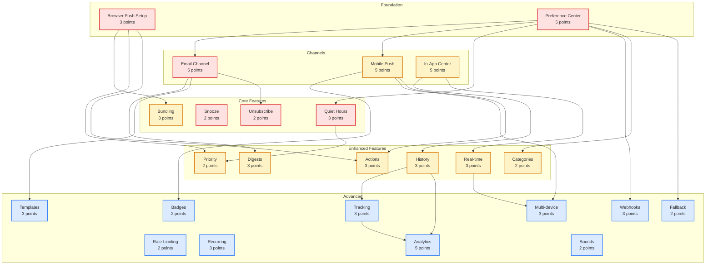

# Notifications Feature - User Stories Index

**Feature**: Notifications & Reminders
**Total Story Points**: 82
**High Priority Stories**: 5
**Medium Priority Stories**: 10
**Low Priority Stories**: 10

## Story List

### High Priority (Sprint 1-2)
1. [NOT-001: Browser Push Notification Setup](./NOT-001-browser-push-setup.md) - **3 points**
2. [NOT-002: Notification Preference Center](./NOT-002-preference-center.md) - **5 points**
3. [NOT-003: Email Notification Channel](./NOT-003-email-notifications.md) - **5 points**
4. [NOT-005: Quiet Hours Configuration](./NOT-005-quiet-hours.md) - **3 points**
5. [NOT-008: Snooze Notifications](./NOT-008-snooze-functionality.md) - **2 points**
6. [NOT-017: Unsubscribe Management](./NOT-017-unsubscribe-management.md) - **2 points**

**Sprint 1-2 Total**: 20 points

### Medium Priority (Sprint 3-4)
1. [NOT-004: Mobile Push Notifications](./NOT-004-mobile-push.md) - **5 points**
2. [NOT-006: In-App Notification Center](./NOT-006-in-app-center.md) - **5 points**
3. [NOT-007: Smart Notification Bundling](./NOT-007-smart-bundling.md) - **3 points**
4. [NOT-009: Notification History](./NOT-009-notification-history.md) - **3 points**
5. [NOT-010: Priority Task Notifications](./NOT-010-priority-notifications.md) - **2 points**
6. [NOT-011: Daily/Weekly Digest Summaries](./NOT-011-digest-summaries.md) - **3 points**
7. [NOT-013: Notification Action Buttons](./NOT-013-action-buttons.md) - **3 points**
8. [NOT-014: Category-Based Preferences](./NOT-014-category-preferences.md) - **2 points**
9. [NOT-019: Real-Time Notification Updates](./NOT-019-real-time-updates.md) - **3 points**

**Sprint 3-4 Total**: 29 points

### Low Priority (Future Sprints)
1. [NOT-012: Webhook Integration](./NOT-012-webhook-integration.md) - **3 points**
2. [NOT-015: Email Template System](./NOT-015-email-templates.md) - **3 points**
3. [NOT-016: Notification Delivery Tracking](./NOT-016-delivery-tracking.md) - **3 points**
4. [NOT-018: Notification Rate Limiting](./NOT-018-rate-limiting.md) - **2 points**
5. [NOT-020: App Badge Management](./NOT-020-badge-management.md) - **2 points**
6. [NOT-021: Multi-Device Notification Sync](./NOT-021-multi-device-sync.md) - **3 points**
7. [NOT-022: Recurring Notification Patterns](./NOT-022-recurring-reminders.md) - **3 points**
8. [NOT-023: Notification Analytics Dashboard](./NOT-023-analytics-dashboard.md) - **5 points**
9. [NOT-024: Fallback Channel Configuration](./NOT-024-fallback-channels.md) - **2 points**
10. [NOT-025: Custom Notification Sounds](./NOT-025-notification-sounds.md) - **2 points**

**Future Sprints Total**: 28 points

## Dependencies Graph

## Implementation Roadmap

### Phase 1: Foundation (Week 1-2)
- Set up notification infrastructure
- Implement browser push notifications
- Create preference center
- Basic quiet hours functionality

### Phase 2: Core Channels (Week 3-4)
- Email notification system
- Email templates and unsubscribe
- In-app notification center
- Snooze functionality

### Phase 3: Mobile & Enhancement (Week 5-6)
- Mobile push notifications
- Smart bundling system
- Notification actions
- Real-time updates

### Phase 4: Advanced Features (Week 7-8)
- Category preferences
- Priority notifications
- Digest summaries
- Notification history

### Phase 5: Analytics & Optimization (Week 9-10)
- Delivery tracking
- Analytics dashboard
- Rate limiting
- Performance optimization

### Phase 6: Polish & Scaling (Week 11-12)
- Multi-device sync
- Webhook integration
- Custom sounds
- Production hardening

## Technical Considerations

### Required Infrastructure
- **Queue System**: Redis + BullMQ for reliable delivery
- **Email Service**: SendGrid or AWS SES
- **Push Services**: FCM for Android, APNs for iOS
- **WebSocket**: Socket.io for real-time updates
- **Database**: PostgreSQL for notification history

### Key Technical Challenges
1. **Multi-channel Orchestration**: Coordinating delivery across channels
2. **Scale**: Handling millions of notifications efficiently
3. **Reliability**: Ensuring delivery with retries and fallbacks
4. **Real-time**: WebSocket connection management
5. **Privacy**: GDPR compliance and data protection

### Performance Targets
- < 2s notification delivery time
- 99.9% delivery success rate
- < 100ms API response time
- Support for 100K concurrent users
- 1M notifications/hour throughput

## Success Metrics
- 80% notification opt-in rate
- < 20% unsubscribe rate
- 30% increase in task completion
- 35% email open rate
- < 5% notification fatigue complaints

## Next Steps
1. Review and prioritize stories with stakeholders
2. Set up notification infrastructure
3. Begin with browser push implementation
4. Establish email service provider
5. Create notification service architecture