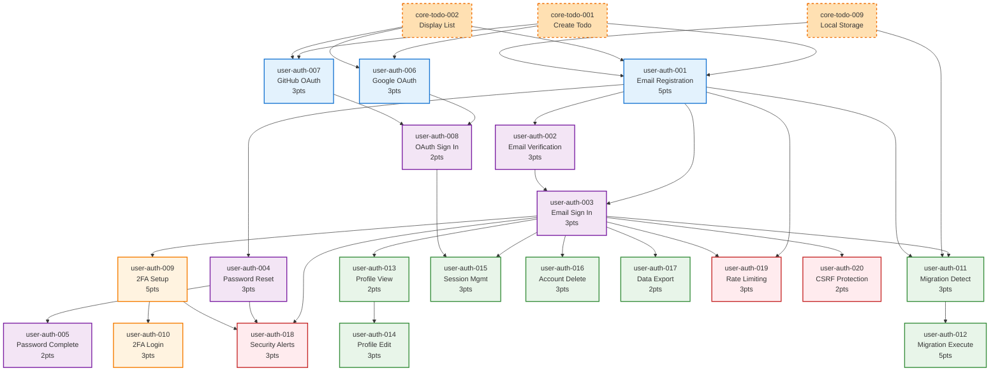

# User Authentication Feature - Story Dependencies

**Feature**: user-auth  
**Total Stories**: 20  
**External Dependencies**: core-todo feature  
**Critical Path Length**: 5 levels  

## Visual Dependency Graph

## Dependency Analysis

### External Dependencies (Core-Todo)

All user authentication features depend on the core-todo feature being completed first:

| Core-Todo Story | Required By | Reason |
|----------------|-------------|--------|
| core-todo-001 | user-auth-001, 006, 007 | Need basic todo creation |
| core-todo-002 | user-auth-001, 006, 007 | Need todo display functionality |
| core-todo-009 | user-auth-001, 011 | Need localStorage for migration |

### Dependency Layers

#### Layer 0: External (Core-Todo)
- Must be completed before any user-auth work begins
- Critical for todo ownership and migration features

#### Layer 1: Foundation (No internal dependencies)
- **user-auth-001**: Email Registration (5 pts)
- **user-auth-006**: Google OAuth (3 pts)
- **user-auth-007**: GitHub OAuth (3 pts)
- **user-auth-019**: Rate Limiting (3 pts)

#### Layer 2: Basic Authentication
- **user-auth-002**: Email Verification → 001
- **user-auth-004**: Password Reset → 001

#### Layer 3: Core Authentication Complete
- **user-auth-003**: Email Sign In → 001, 002
- **user-auth-005**: Password Complete → 004
- **user-auth-008**: OAuth Sign In → 006, 007
- **user-auth-020**: CSRF Protection → 003

#### Layer 4: Authenticated Features
- **user-auth-009**: 2FA Setup → 003
- **user-auth-011**: Migration Detect → 001, 003, CT9
- **user-auth-013**: Profile View → 003
- **user-auth-015**: Session Management → 003, 008
- **user-auth-016**: Account Deletion → 003
- **user-auth-017**: Data Export → 003
- **user-auth-018**: Security Alerts → 003, 004, 009

#### Layer 5: Advanced Features
- **user-auth-010**: 2FA Login → 009
- **user-auth-012**: Migration Execute → 011
- **user-auth-014**: Profile Edit → 013

### Critical Path Analysis

The longest dependency chain that must be completed sequentially:

1. **core-todo-001, 002, 009** (External prerequisites)
2. **user-auth-001** - Email Registration (5 points)
3. **user-auth-002** - Email Verification (3 points)
4. **user-auth-003** - Email Sign In (3 points)
5. **user-auth-009** - 2FA Setup (5 points)
6. **user-auth-010** - 2FA Login (3 points)

**Total Critical Path**: 19 story points (excluding core-todo)

### Parallel Development Opportunities

#### Sprint 1 Parallel Tracks
- **Track A**: user-auth-001, 002, 003 (Email flow)
- **Track B**: user-auth-019, 020 (Security)
- **Track C**: user-auth-006, 007 (OAuth setup)

#### Sprint 2 Parallel Tracks
- **Track A**: user-auth-004, 005 (Password reset)
- **Track B**: user-auth-008 (OAuth sign in)

#### Sprint 3 Parallel Tracks
- **Track A**: user-auth-011, 012 (Migration)
- **Track B**: user-auth-013, 014 (Profile)

#### Sprint 4 Parallel Tracks
- **Track A**: user-auth-009, 010 (2FA)
- **Track B**: user-auth-015 (Sessions)
- **Track C**: user-auth-018 (Alerts)

### Blocking Dependencies

| Story | Blocks Count | Blocked By Count | Criticality |
|-------|--------------|------------------|-------------|
| core-todo-* | 5 stories | 0 | External Critical |
| user-auth-001 | 8 stories | 3 (external) | Critical |
| user-auth-003 | 9 stories | 2 | Critical |
| user-auth-009 | 2 stories | 1 | High |
| user-auth-011 | 1 story | 4 | Medium |

### Development Strategy

#### Phase 1: Foundation
1. Complete all core-todo dependencies
2. Set up authentication infrastructure
3. Implement user-auth-001 (Email Registration)
4. Add security layers (019, 020) early

#### Phase 2: Authentication Flows
1. Complete email verification (002)
2. Implement sign in (003)
3. Set up OAuth providers in parallel (006, 007)
4. Add password reset flow (004, 005)

#### Phase 3: User Features
1. Detect and migrate todos (011, 012)
2. Build profile system (013, 014)
3. Add OAuth sign in (008)

#### Phase 4: Advanced Security
1. Implement 2FA (009, 010)
2. Add session management (015)
3. Set up security alerts (018)

#### Phase 5: Account Management
1. Account deletion (016)
2. Data export (017)
3. Final integration and testing

### Risk Mitigation

#### High-Risk Dependencies
1. **External dependency on core-todo**
   - Mitigation: Ensure core-todo team awareness
   - Start planning during core-todo development

2. **user-auth-001 blocks 8 stories**
   - Mitigation: Prioritize and thoroughly test
   - Have backup developer ready

3. **Complex OAuth integration**
   - Mitigation: Set up OAuth apps early
   - Test with development credentials first

#### Dependency Bottlenecks
- **Sign In (003)**: Required by 9 other stories
- **Email Registration (001)**: Foundation for everything
- **2FA Setup (009)**: Complex implementation

### Optimized Development Order

1. **Pre-work**: Set up infrastructure, NextAuth.js
2. **Week 1-2**: 001, 002, 019, 020 (Foundation + Security)
3. **Week 3-4**: 003, 004, 005, 006, 007 (Auth flows)
4. **Week 5-6**: 008, 011, 012, 013, 014 (Features)
5. **Week 7-8**: 009, 010, 015, 018 (Advanced)
6. **Week 9-10**: 016, 017, testing, deployment

---

**Last Updated**: 2025-07-22  
**Tool**: Mermaid diagram (render in any Markdown viewer)  
**Note**: Ensure core-todo feature is complete before starting